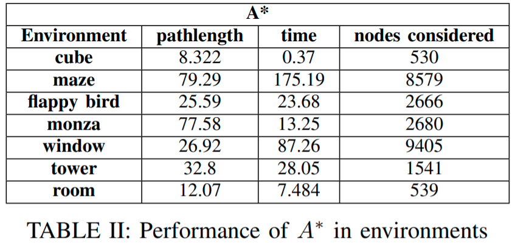

# Motion planning with A* and RRT*

Description
===========
This is project on Motion Planning is done by Ayon Biswas[A53318795].

Dependiencies Used
==================
* Pyrr - for collision detection (pip install pyrr)
* ompl - for RRT* (https://ompl.kavrakilab.org/installation.html)
* pqdict - for priority queue (pip install pqdict)

Code organization
=================
* Astar.py -- Run the script for performing A* by setting the environment and discretisation value

* ompl_RRT.py -- Run the script for performing RRT* by setting the environment and runtime

Results
=======
A*           |  RRT*
:-------------------------:|:-------------------------:
 | 
 | 
 | 

Datasets
========
Test environments was provided with the starter code.

Acknowledgements
================
We thank Prof. Nikolay Atanasov and TAs for their guidance and support.

